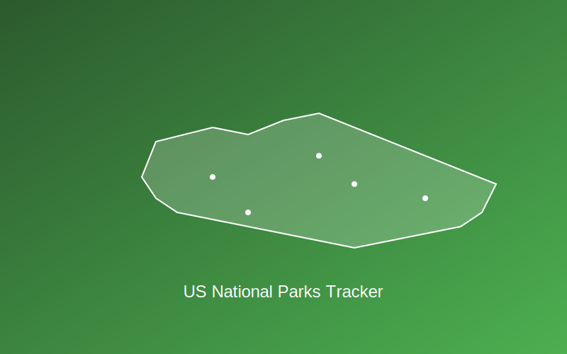

# 🏞️ US National Parks Tracker

```
██╗    ██╗ █████╗ ██████╗ ███╗   ██╗██╗███╗   ██╗ ██████╗
██║    ██║██╔══██╗██╔══██╗████╗  ██║██║████╗  ██║██╔════╝
██║ █╗ ██║███████║██████╔╝██╔██╗ ██║██║██╔██╗ ██║██║  ███╗
██║███╗██║██╔══██║██╔══██╗██║╚██╗██║██║██║╚██╗██║██║   ██║
╚███╔███╔╝██║  ██║██║  ██║██║ ╚████║██║██║ ╚████║╚██████╔╝
 ╚══╝╚══╝ ╚═╝  ╚═╝╚═╝  ╚═╝╚═╝  ╚═══╝╚═╝╚═╝  ╚═══╝ ╚═════╝
```

### 🌟 This is certified vibe code 🌟

### Proceed with good vibes only 🏄‍♂️

Track your journey through America's most breathtaking landscapes! This interactive map helps you visualize and track visits to all 63 US National Parks.

<div align="center">
  
</div>

Built with [Cursor](https://cursor.com), the AI-first code editor.

<div align="center">
  <a href="https://cursor.com">
    <picture>
      <source media="(prefers-color-scheme: dark)" srcset="https://www.cursor.com/assets/images/logo.svg">
      <source media="(prefers-color-scheme: light)" srcset="https://www.cursor.com/assets/images/logo.svg">
      
    </a>
  </picture>
</div>

## ✨ Features

- 🗺️ **Interactive Map**: Beautiful visualization of all 63 US National Parks
- 🎯 **Visit Tracking**: Mark parks as visited and track your progress
- 📊 **Real-time Stats**: See your visit count and completion percentage
- 🔍 **Smart Search**: Find parks by name, state, or description
- 🏷️ **Filtering**: Quick filters for visited/unvisited parks
- 📱 **Responsive Design**: Works great on both desktop and mobile
- 🎨 **State-based Colors**: Each state has its unique color for easy identification
- 💾 **Persistent Storage**: Your visited parks are saved locally

## 🚀 Quick Start

Visit the live site: [US National Parks Tracker](https://nathanleiby.github.io/usa-national-parks-map/)

Or run locally:

```bash
# Clone the repository
git clone https://github.com/nathanleiby/usa-national-parks-map.git

# Navigate to the project directory
cd usa-national-parks-map

# Start a local server (e.g., using live-server)
npx live-server
```

## 🎯 Usage

1. **View Parks**: Explore all National Parks on the interactive map
2. **Track Visits**: Click on a park marker and use the "Mark as Visited" button
3. **Search**: Use the search bar to find specific parks or states
4. **Filter**: Use the filter buttons to show all, visited, or unvisited parks
5. **Stats**: Track your progress with the counter at the top

## 🏗️ Built With

- [Leaflet.js](https://leafletjs.com/) - Interactive maps
- [MarkerCluster](https://github.com/Leaflet/Leaflet.markercluster) - Clustering for markers
- HTML5 Local Storage - Persistent data storage
- GitHub Pages - Hosting

## 📝 License

This project is open source and available under the MIT License.

---

<div align="center">
  <a href="https://cursor.com/">
    
  </a>
</div>
